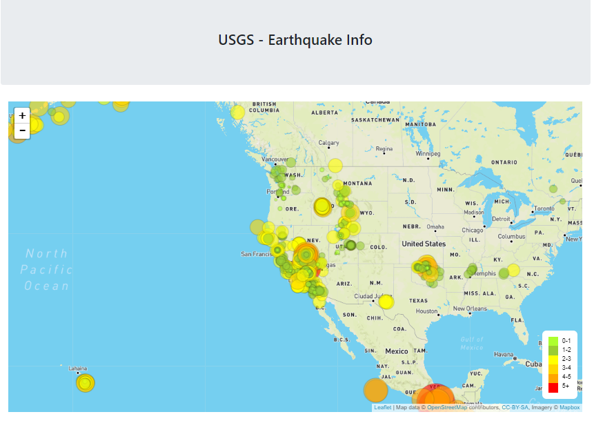
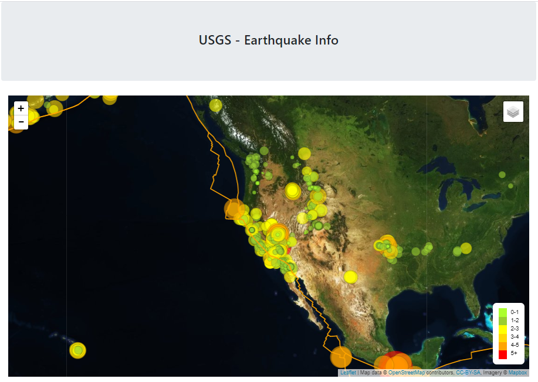

# Visualizing Data with Leaflet

## Background

Welcome to the United States Geological Survey, or USGS for short! The USGS is responsible for providing scientific data about natural hazards, the health of our ecosystems and environment; and the impacts of climate and land-use change. Their scientists develop new methods and tools to supply timely, relevant, and useful information about the Earth and its processes.  

The USGS collects a massive amount of data from all over the world each day. Task is to visualize the data to for better education to the public on issues facing our planet.

### Level 1: Basic Visualization

The USGS provides earthquake data in a number of different formats, updated every 5 minutes. Visit the [USGS GeoJSON Feed](http://earthquake.usgs.gov/earthquakes/feed/v1.0/geojson.php) page and pick a data set to visualize. We will be using 'All Earthquakes from the Past 7 Days' for the earthquake visualization. 

### Level 2: More Data 

Add tectonic plates on the earthquake visualization. Data on tectonic plates is available at <https://github.com/fraxen/tectonicplates>.

###### Copyright

###### Trilogy Education Services © 2019. All Rights Reserved.
